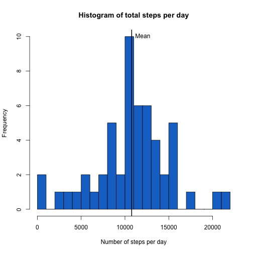
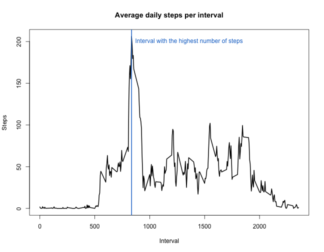
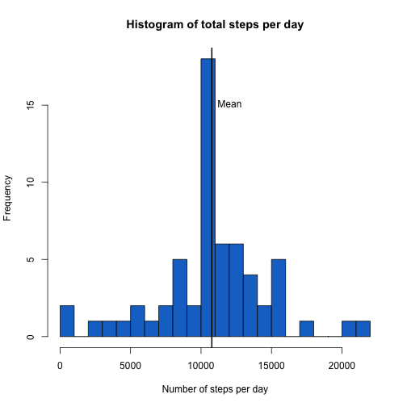
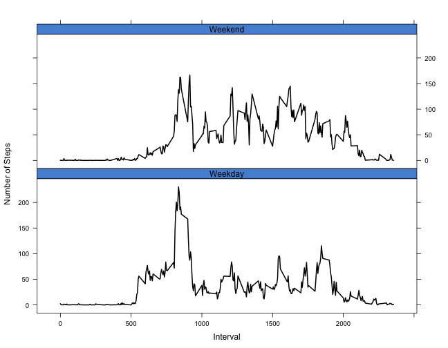

# "Reproducible Research: Peer Assessment 1"


## Loading and preprocessing the data

```r
activity <- read.csv(unzip("activity.zip"), stringsAsFactors=FALSE)
activity$date <- as.Date(activity$date,"%Y-%m-%d")
head(activity)
```

```
##   steps       date interval
## 1    NA 2012-10-01        0
## 2    NA 2012-10-01        5
## 3    NA 2012-10-01       10
## 4    NA 2012-10-01       15
## 5    NA 2012-10-01       20
## 6    NA 2012-10-01       25
```


## What is mean total number of steps taken per day?

```r
stepsperday <- by(activity$steps,activity$date,sum)
meansteps <- mean(stepsperday,na.rm=TRUE)
mediansteps <- median(stepsperday,na.rm=TRUE)
hist(stepsperday,breaks=30,xlab="Number of steps per day",main = "Histogram of total steps per day",
     col=rgb(0.094,0.455,0.804))
abline(v=meansteps,lwd=2)
text(meansteps,10,pos=4,"Mean")
```



The mean total number of steps per day is **10766** and the median total number
of steps per day is **10765**.


## What is the average daily activity pattern?

```r
meansteps = by(activity$steps,activity$interval,mean,na.rm=TRUE)
highint <- which.max(meansteps)
plot(meansteps,type="l",lwd=2,xlab="Interval",ylab="Steps",main="Average daily steps per interval")
abline(v=which.max(meansteps),col=rgb(0.094,0.455,0.804),lwd=2)
text(highint,200,pos=4,"Interval with the highest number of steps",col=rgb(0.094,0.455,0.804))
```



Interval number **104** has the highest average daily number of steps (206).

## Imputing missing values

```r
noNA <- sum(is.na(activity$steps))
newActivity <- activity %>% 
    group_by(interval) %>% 
    mutate(steps = ifelse(is.na(steps), as.integer(round(mean(steps,na.rm=TRUE))), steps))
stepsperday <- by(newActivity$steps,newActivity$date,sum)
meanperday = mean(stepsperday,na.rm=TRUE)
medianperday = median(stepsperday,na.rm=TRUE)
hist(stepsperday,breaks=30,xlab="Number of steps per day",main = "Histogram of total steps per day",
     col=rgb(0.094,0.455,0.804))
abline(v=meanperday,lwd=2)
text(meanperday,15,pos=4,"Mean")
```



The new mean total number of steps per day is 10765 and the median total number
of steps per day is 10762. These values do not differ significantly from the mean and median calculated before. Imputing missing data with the mean for that interval did only increase the frequency of mean/median level total number of steps per day. 


## Are there differences in activity patterns between weekdays and weekends?

```r
newActivity$dayofweek <- factor(ifelse(weekdays(newActivity$date) %in% c("Saturday","Sunday"),"Weekend","Weekday"))
meanActivity <- newActivity %>% group_by(dayofweek,interval) %>%
    summarise(steps = mean(steps))
xyplot(steps~interval|dayofweek,data = meanActivity,type="l",lwd=2,col="black", xlab="Interval",
       ylab="Number of Steps", par.settings=list(strip.background=list(col=rgb(0.094,0.455,0.804,0.8))),
       layout=c(1,2))
```




